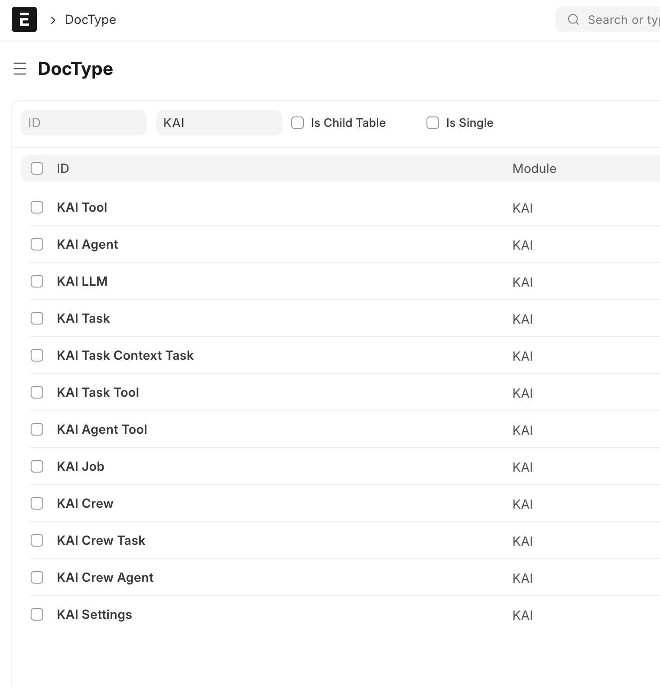
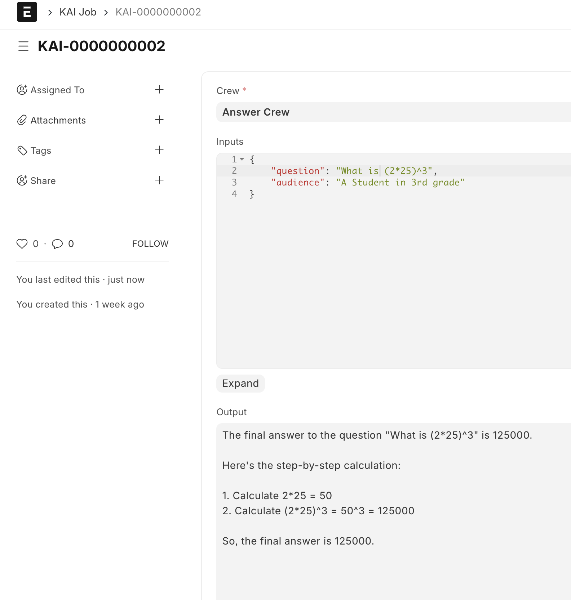
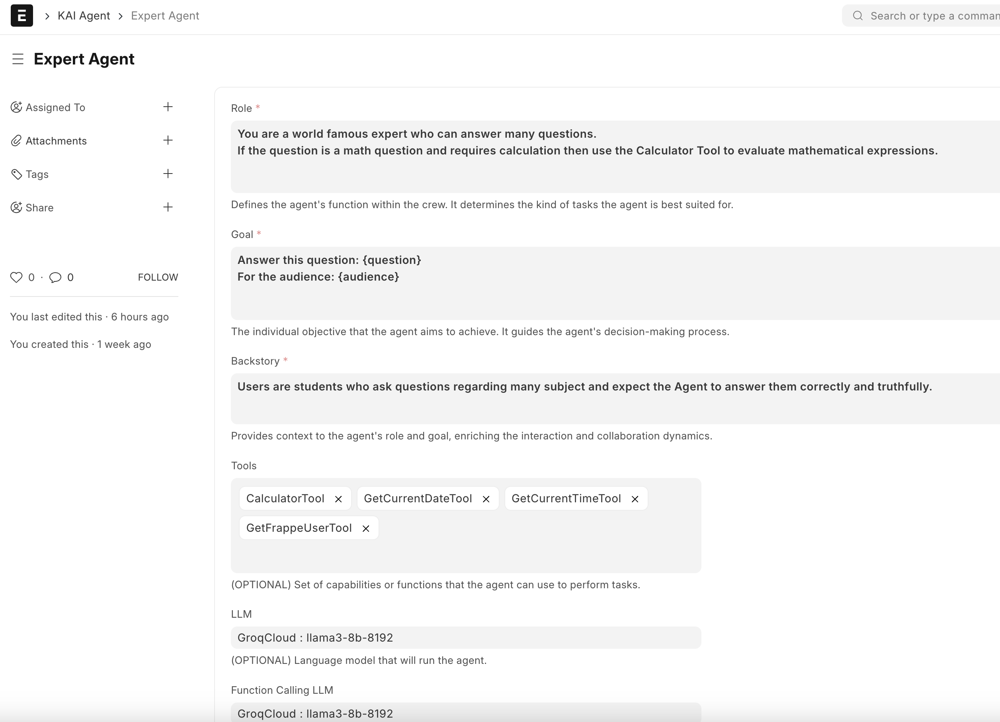
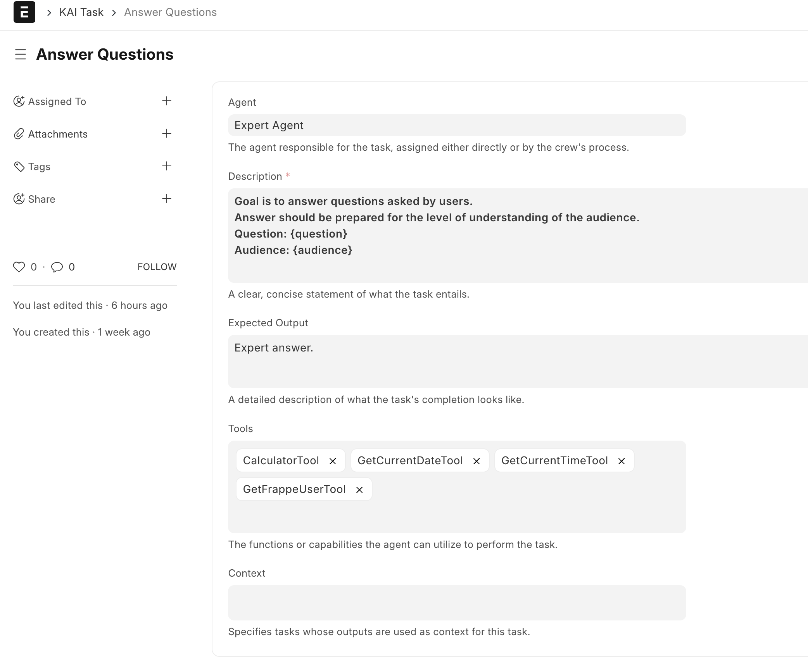
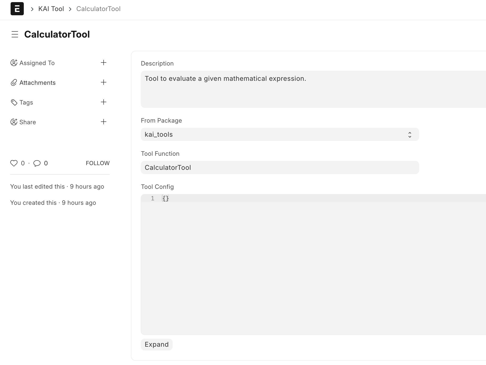
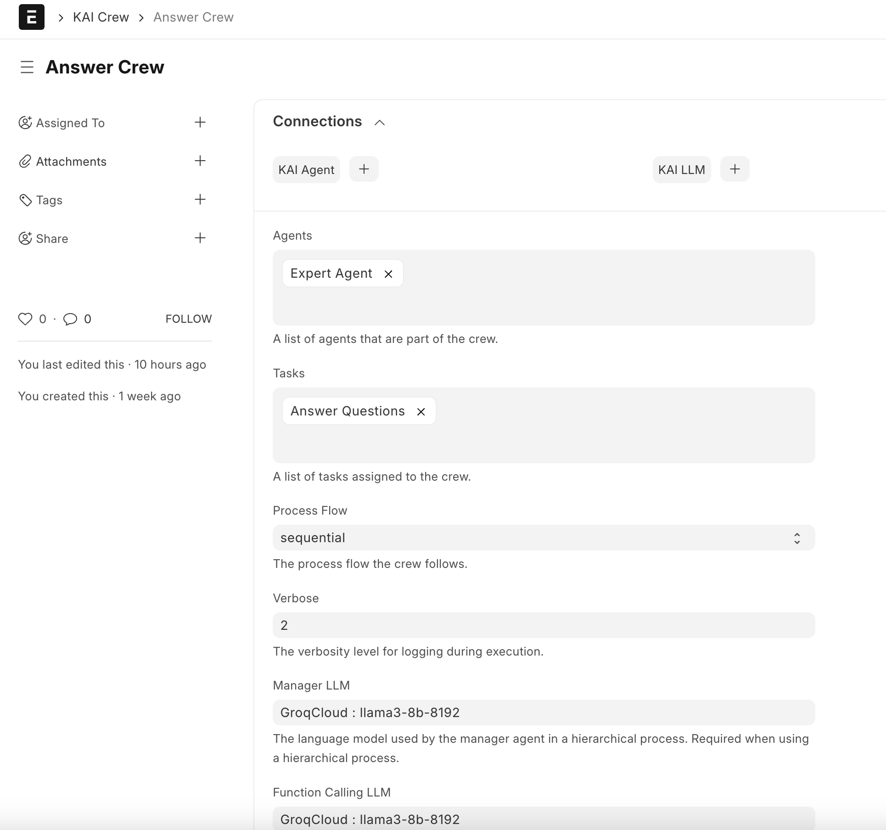
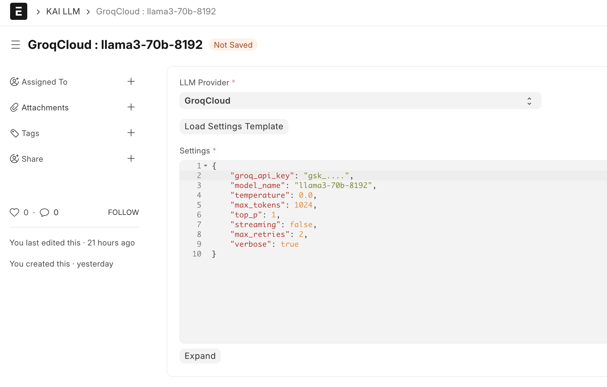
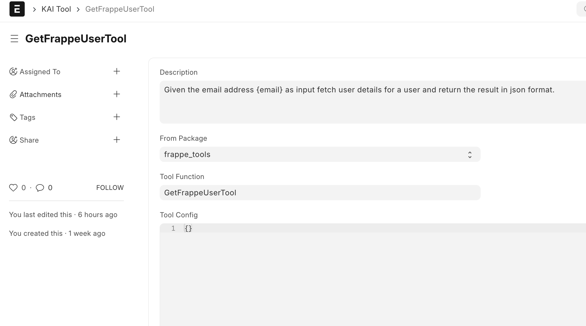
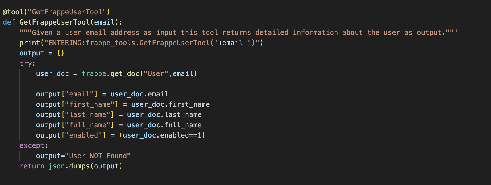

## KAI

KAI is a custom app for Frappe Framework that implements CrewAI framework to integrate AI Agents with Frappe Framework.
If you are not familiar with these platforms please take a look at the following web sites.

- https://www.crewai.com/
- https://frappeframework.com/

### KEY CONCEPTS

- LLM
:: Large Language Models are machine learning models that can comprehend and generate human language text.
- CREW
:: A crew represents a collaborative group of agents working together to achieve a set of tasks.
- AGENT
:: An agent is an autonomous unit programmed to perform TASKS, make decisions and communicate with other agents.
- TASK
:: Specific assignments completed by agents.
- TOOL
:: A tool is a skill or function that agents can utilize to perform various actions. 
- JOB
:: Set of Inputs given to a crew to be used by agents to produce a result or output.

LLM, CREW, AGENT, TASK, TOOL, JOB are implemented as DocType.\
So you can create unlimited Crews, Agents and Tasks to accomplish unique goals.\
You can interact with Crews via UI or python fucntion calls.\

Currently KAI can interface with the following LLM providers:
- GroqCloud (fastest, free for now)
- Ollama (local, slow but free)
- OpenAI (soon, paid)
- AWS Bedrock (soon, paid)

We have tested KAI with llama3-8B and llama3-70B on GroqCloud but there is no reason why you cannot use other LLMs.

### INSTALLATION

Since KAI is a Custom Frappe App it can be installed using frappe bench CLI commands.
```
bench get-app https://github.com/KorucuTech/kai.git
```
```
bench --site your-site-name install kai
```




### HOW TO RUN
After you create CREW,AGENT,TASK,TOOL definitions you can run the crew with input to get an output.
```
import frappe

crew_name = "My Science Crew"
crew = frappe.get_doc("KAI Crew",crew_name)

inputs = { "question": "Why is the sky Blue" }
output = crew.kickoff(inputs=inputs)
print(output)
```

How about this to verify if a user exists in Frappe and is Authorized.

```
import frappe

crew_name = "My Security Crew"
crew = frappe.get_doc("KAI Crew",crew_name)

inputs = { "email": "me@here.com" }
output = crew.kickoff(inputs=inputs)
print(output)
```

You can also run a crew from a JOB



This is the AGENT that answered the question.



This was the TASK at hand.



Agent decides if it needs to use a tool to complete a TASK. Here is a TOOL definition.



And here is the very simple CREW that has only one AGENT that worked on the answer.



You must have an LLM setup to begin with.



Technically you can write these CREWS,AGENTS,TASKS etc. in pure python.
KAI gives you a way to do it via frappe UI and use/call them directly from any frappe app or server script.

It is possible to add more TOOLS to do much more with Frappe or even ERPNext.

Here is a simple TOOL that checks if a user exists given an email address.



Here is the backend of this TOOL!



Hard part of this is writing/testing/re-writing the "prompts" so that AGNETS can produce the result you want.

Let me know what you think!

### LICENSE

MIT
